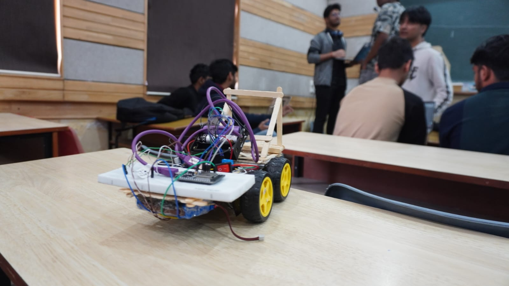
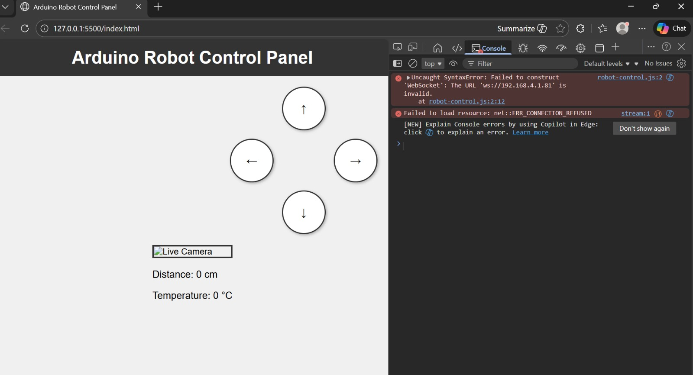
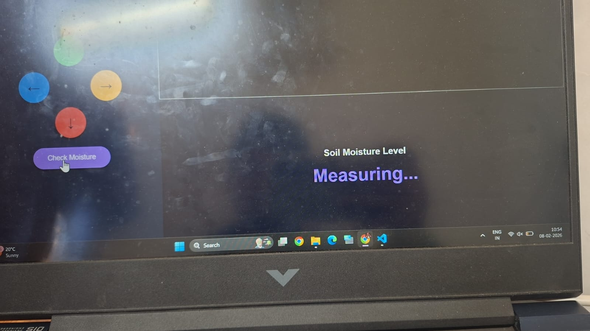

# Electrothon Rover – Soil Moisture Monitoring Rover

Rover built during Electrothon Hackathon (EEE Society, BIT Mesra).  
Controlled via web interface, and returns soil moisture as percentage using ESP32.

## Prototype

## Web Interface

## Moisture Output

## Repository Structure
- `esp32_code/` ESP32 firmware
- `web_interface/` control webpage
- `images/` project visuals
