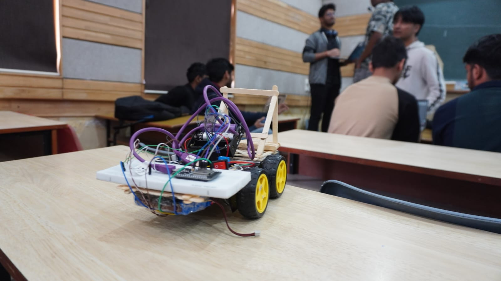
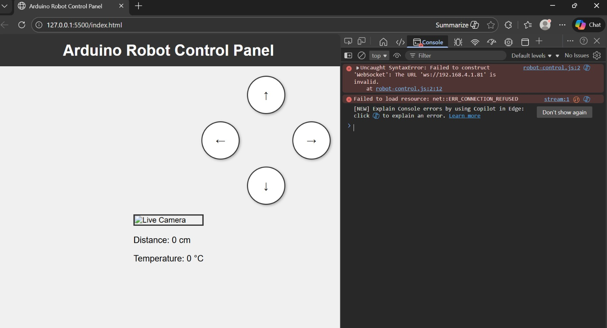
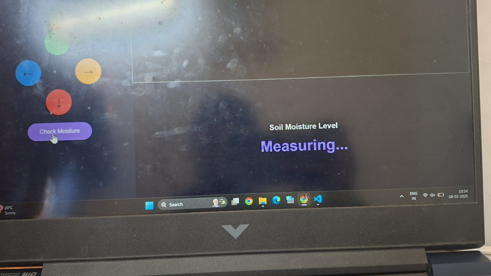

# Electrothon Rover – Soil Moisture Monitoring System

An IoT-based rover built during the Electrothon Hackathon (EEE Society, BIT Mesra), designed to enable remote control and real-time soil moisture monitoring using low-cost hardware.

## Overview
The system integrates an ESP32 microcontroller with sensors and a web interface to allow users to control the rover and retrieve soil moisture data in real time.

## Working Pipeline
Web Interface → Command Transmission → ESP32 → Motor Control + Sensor Reading → Data Response → Web Interface

## Key Features
- Remote control of rover via web interface  
- Real-time soil moisture sensing and percentage output  
- Bidirectional communication between frontend and hardware  
- Low-cost embedded system design  

## My Contribution
- Implemented the communication layer between the web interface and ESP32  
- Enabled reliable transmission of control commands and sensor data  
- Worked on integrating hardware components with backend logic  

## Prototype

## Web Interface

## Moisture Output

## Demo Videos

- ▶️ **Rover Operation:** [Watch Video](https://drive.google.com/file/d/1C1JqgriYy310lbdlKDqsEjoANji-o_nh/view?usp=sharing)  
- ▶️ **Web Interface & Control:** [Watch Video](https://drive.google.com/file/d/1-LHpVBXQbVpLxwL9TpUG45_aINoE62SX/view?usp=sharing)
## Repository Structure
- `esp32_code/` – ESP32 firmware  
- `web_interface/` – control interface  
- `images/` – project visuals  

## Learnings
- Handling real-time communication between hardware and web systems  
- Debugging multi-component systems involving sensors and controllers  
- Designing reliable data flow in constrained environments  
